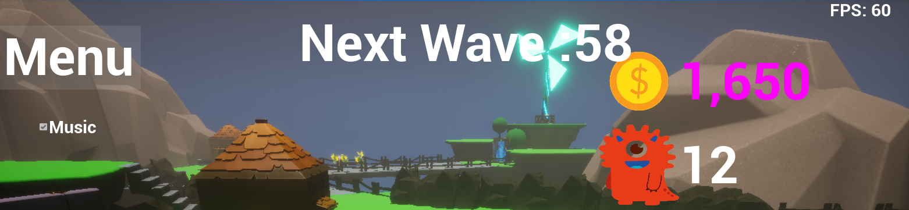

# I_Need_Healing
I_Need_Healing

## Project Overview
### Engine Used: Unreal Engine 5.2

## Introduction
Welcome to "I_Need_Healing", a lightweight mobile game that combines elements of tower defense and shooting.

Enemies are controlled by AiController and behavior trees, exhibiting autonomous attack functionality and simple retreat behavior.

In the game, enemies will gradually approach the main city from four directions, and failure will occur if the main city is breached! Try building additional defense towers on BuildTiles to resist enemy attacks. Your teammates will also assist you from the side, but if they get injured, they will continuously ask you for healing!!!

Remember! You are a doctor and cannot engage in attacks.

|  |  |  |
|---|---|---|

In-game features include an enemy spawner and a counter, providing players with the option to continue challenging themselves by generating more powerful enemies after eliminating those present in the map.
|  |
|---|

## Technical Details
Optimized for mobile platforms, the game ensures high-performance gameplay, allowing it to run at a smooth frame rate on mobile devices.
Enemy behavior is controlled through behavior trees.
Utilized C++ code for certain functionalities.

## Features
Player Controls: Basic movement and Skill controls.
Enemy AI: Autonomous attack and simple retreat behaviors.
Visual Effects: Utilizes the Niagara effects system for impactful visuals during combat.
Music System: Enhances player experience with dynamic sound effects.
Enemy Spawner: Continues the challenge by generating more enemies after defeating the current ones.
